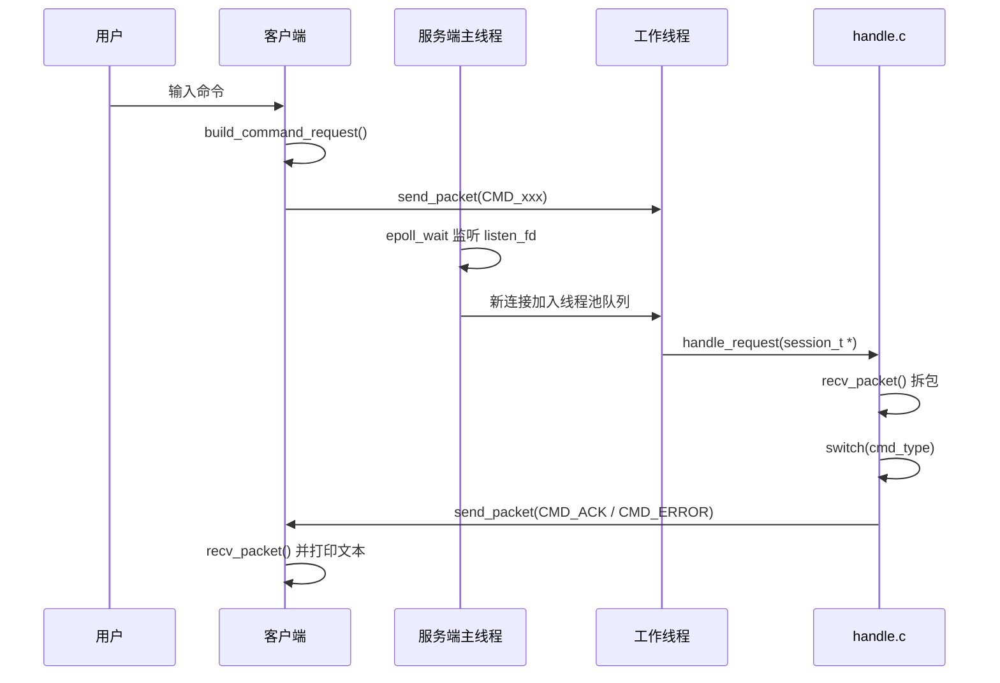
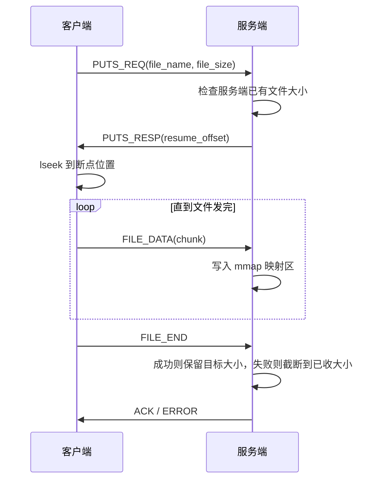
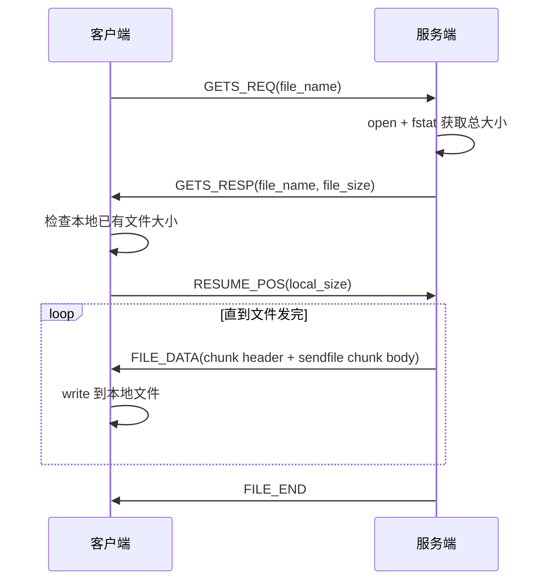

# 项目第一二期技术解析

## 1. 文档范围

本文档只解析当前项目中**第一期与第二期**已经实现的内容：

- 客户端与服务端基于 TCP 的命令交互
- `pwd`、`cd`、`ls`、`mkdir`、`rm`、`puts`、`gets`
- TLV 协议封包与拆包
- 断点续传
- `mmap` / `sendfile`
- `epoll + 线程池 + pipe 通知退出`
- 日志与配置

本文档**不讨论**第三期及之后的数据库、JWT、真正多用户隔离、多点下载等功能。

---

## 2. 当前系统总体结构

### 2.1 模块划分

当前代码可以分成 5 个核心层次：

1. **公共层**
   - `src/common/protocol.c`
   - `src/common/config.c`
   - `src/common/log.c`
2. **客户端层**
   - `src/client/client.c`
   - `src/client/client_socket.c`
   - `src/client/client_command_handle.c`
3. **服务端主控层**
   - `src/server/server.c`
   - `src/server/server_socket.c`
   - `src/server/epoll.c`
4. **线程池层**
   - `src/server/thread_pool.c`
   - `src/server/worker.c`
   - `src/server/queue.c`
5. **业务处理层**
   - `src/server/handle.c`

### 2.2 模块职责

| 模块 | 职责 |
| --- | --- |
| `protocol.c` | 定义命令枚举、TLV 头、统一 `send_n/recv_n/send_packet/recv_packet` |
| `config.c` | 从 `config/config.ini` 加载 IP、端口、日志级别、日志文件名 |
| `log.c` | 提供线程安全日志输出，日志中带文件名、行号、函数名 |
| `client.c` | 读取标准输入，建立连接，初始化日志 |
| `client_command_handle.c` | 把用户输入变成 TLV 请求，并处理响应、上传、下载 |
| `server.c` | 初始化 socket、线程池、epoll，自管退出流程 |
| `worker.c` | 工作线程从任务队列取连接，为每个连接创建 `session_t` |
| `handle.c` | 解析包、路由命令、处理目录与文件传输 |

---

## 3. 服务端与客户端交互总览

### 3.1 普通命令时序

普通命令指 `pwd`、`cd`、`ls`、`mkdir`、`rm` 这类不直接传文件的数据操作。



### 3.2 上传 `puts` 时序



### 3.3 下载 `gets` 时序



---

## 4. TLV 协议设计

### 4.1 为什么要引入 TLV

早期版本直接混用：

- 命令长度
- 裸字符串
- 裸 `off_t`
- 裸文件流

这种做法的根本问题是：**TCP 是字节流，不是消息流**。

也就是说：

- 一次 `send()` 不保证对端一次 `recv()` 就能完整拿到
- 多次 `send()` 可能在对端被一次 `recv()` 连着读出来
- 如果一边按“先读 `off_t`”理解，另一边实际发的是“文本长度 + 文本内容”，协议就会错位

TLV 的意义就是：先给对端一个**统一格式的头部**，让对端知道“这一包是什么类型、有效负载有多长、状态码是什么”，这样后续读取行为才有明确边界。

### 4.2 协议头结构

当前头文件定义见 `include/protocol.h`：

```c
typedef struct {
    uint32_t magic;
    uint32_t version;
    uint32_t cmd_type;
    uint32_t status;
    uint32_t data_len;
} tlv_header_t;
```

每个字段 4 字节，总共 20 字节。

内存布局可以理解为：

| 偏移 | 字段 | 大小 | 作用 |
| --- | --- | --- | --- |
| 0 | `magic` | 4 | 魔数，确认这是本协议包 |
| 4 | `version` | 4 | 协议版本 |
| 8 | `cmd_type` | 4 | 命令或数据类型 |
| 12 | `status` | 4 | 状态码 |
| 16 | `data_len` | 4 | 负载长度 |

### 4.3 命令类型枚举

当前命令和数据类型统一放进 `cmd_type_t`：

- `CMD_PWD`
- `CMD_CD`
- `CMD_LS`
- `CMD_RM`
- `CMD_MKDIR`
- `CMD_PUTS_REQ`
- `CMD_PUTS_RESP`
- `CMD_GETS_REQ`
- `CMD_GETS_RESP`
- `CMD_RESUME_POS`
- `CMD_FILE_DATA`
- `CMD_FILE_END`
- `CMD_ACK`
- `CMD_ERROR`

这样做有两个直接好处：

1. 服务端不再写很长的 `if (strcmp(cmd, "..."))`
2. 报文里不只表达“命令”，还表达“上传响应”“文件块”“结束包”等状态

### 4.4 为什么要做网络字节序转换

头部里所有固定宽度整数，在发包前都会转换成网络字节序：

- `htonl()`
- `ntohl()`

这是因为不同机器可能使用不同字节序。  
网络协议约定统一使用**大端序**，这样不同主机才能按同样方式解释字段。

当前 `uint64_t` 用自定义的：

- `host_to_net_u64()`
- `net_to_host_u64()`

来拆成两个 32 位片段再转换。

这里也顺便说明一个常见误区：

- `off_t` 不能直接裸发到网络上，因为它的位宽不一定固定
- 网络协议应该传固定宽度类型，例如 `uint64_t`

### 4.5 包的发送与接收

协议层的核心函数是：

- `send_n()`
- `recv_n()`
- `send_packet()`
- `recv_packet()`

#### `send_n()` 的作用

它会循环调用 `write()`，直到：

- 所有字节都写完
- 或者发生不可恢复错误

这是因为单次 `write()` 可能只写出一部分数据。

#### `recv_n()` 的作用

它会循环调用 `recv()`，直到：

- 期望长度全部读满
- 或对端关闭连接
- 或发生不可恢复错误

这解决了“半包”问题。

#### `recv() == 0` 代表什么

在 TCP 中，`recv()` 返回 0 的语义是：

- 对端已经进行了有序关闭
- 当前连接上不会再有更多数据

所以代码里一旦 `recv_n()` 发现某次 `recv()` 返回 0，就会把它视为连接结束。

---

## 5. 服务端并发模型

### 5.1 为什么不是“一个连接一个进程”

当前实现保留了：

- `epoll`
- 线程池

主线程只负责：

- 监听新连接
- 监听退出通知

不直接处理具体业务。

这样做的优点是：

- 主线程职责单一
- 不会因为一个客户端在传大文件而阻塞整个监听线程
- 工作者线程数量可控，不会无限增长

### 5.2 `epoll + 线程池` 的分工

主线程在 `server.c` 中：

1. 创建监听 socket
2. 创建线程池
3. 创建 `epoll`
4. 将 `listen_fd` 和 `pipe_fd[0]` 加入 `epoll`
5. 在 `epoll_wait()` 中等待事件

如果 `listen_fd` 就绪：

- 调用 `accept()`
- 把新连接 `conn_fd` 入队
- 唤醒一个工作线程

如果 `pipe_fd[0]` 就绪：

- 说明收到退出通知
- 主线程开始执行全局退出流程

### 5.3 工作线程如何处理连接

工作线程逻辑在 `worker.c`：

1. 从队列中取出 `client_fd`
2. 初始化一个 `session_t`
3. 把这个 `session_t` 交给 `handle_request()`
4. 业务完成后关闭 fd

当前 `session_t` 包含：

- `peer_fd`
- `current_path`
- `user_id`
- `should_close`

其中：

- `current_path` 维护当前连接所在虚拟路径
- `user_id` 第二阶段只是预留字段，默认 `-1`
- `should_close` 用于协议错误或退出时收口连接

### 5.4 为什么退出时还需要 `active_fds`

如果服务端只设置 `exitFlag = 1`，只能唤醒那些正阻塞在条件变量上的空闲线程。

但如果某个工作线程正在：

- `recv_packet()`
- 上传循环中接收 `FILE_DATA`
- 下载循环中发包

那么它根本不会立刻看到 `exitFlag`。

为了解决这个问题，线程池额外维护：

- `active_fds`

它记录当前哪些连接正被工作线程处理。

主线程收到 `SIGINT` 后会调用：

- `shutdown_active_fds()`

对这些连接执行 `shutdown(fd, SHUT_RDWR)`。

这样阻塞在 `recv()` 的线程会立刻返回，线程才能退出。

### 5.5 pipe 通知退出机制

服务端没有直接在信号处理函数里做复杂逻辑，而是使用了经典的 self-pipe 技术：

1. `SIGINT` 到来
2. 信号处理函数只做一件事：`write(pipe_fd[1], "1", 1)`
3. `pipe_fd[0]` 变成可读
4. `epoll_wait()` 被唤醒
5. 主线程在安全上下文里做完整的退出逻辑

这样做的原因是：

- 信号处理函数里不能安全调用大量复杂函数
- 但 `write()` 到 pipe 是异步信号安全的

这是服务端退出机制最关键的设计点之一。

---

## 6. 命令实现拆解

### 6.1 `pwd`

实现最简单：

- 客户端发 `CMD_PWD`
- 服务端直接把 `session->current_path` 返回

当前 `current_path` 是每个连接自己的虚拟路径字符串，默认值是 `/`。

### 6.2 `cd`

`cd` 的重点不在 `chdir()`，而在**维护虚拟路径**。

当前服务端没有真的切换进程工作目录，而是：

1. 用 `normalize_virtual_path()` 计算新虚拟路径
2. 处理 `.` 和 `..`
3. 禁止绝对路径参数
4. 再拼出真实磁盘路径
5. 通过 `opendir()` 验证目录是否存在
6. 成功后更新 `session->current_path`

这样做的好处是：

- 每个客户端连接都有自己的“当前位置”
- 不会影响服务端进程本身的工作目录

### 6.3 `ls`

`ls` 的步骤是：

1. 由虚拟路径拼出真实路径
2. `opendir()`
3. `readdir()` 遍历目录项
4. 跳过 `.` 和 `..`
5. 把目录项名称拼接成文本结果
6. 作为 `CMD_ACK` 的 payload 发回客户端

这里的实现重点是：

- 用 `snprintf()` 控制拼接边界
- 成功路径必须 `closedir()`

### 6.4 `mkdir`

`mkdir` 的核心是：

1. 对参数做路径归一化
2. 拼接真实路径
3. 调用 `mkdir(real_path, 0755)`

成功返回“创建文件夹成功”，失败返回错误包。

### 6.5 `rm`

`rm` 的步骤和 `mkdir` 类似：

1. 先把参数解析为目标路径
2. 再调用 `remove()`

当前项目阶段只处理普通删除，不做数据库回收等高级逻辑。

### 6.6 `puts` 上传

这是第二期最关键的命令之一。

客户端端：

1. `open()` 本地文件
2. `fstat()` 获取总大小
3. 发送 `PUTS_REQ(file_name, file_size)`
4. 接收服务端 `PUTS_RESP(resume_offset)`
5. `lseek()` 到断点位置
6. 按 `FILE_BLOCK_SIZE` 循环发送 `CMD_FILE_DATA`
7. 发送 `CMD_FILE_END`
8. 等待服务端 `ACK`

服务端端：

1. 解析 `PUTS_REQ`
2. 打开目标文件
3. `fstat()` 看服务端本地已有多大
4. 返回 `resume_offset`
5. 如果本地文件比客户端总大小还大，先截断为 0
6. `ftruncate(file_fd, total_size)`
7. `mmap()` 整个目标文件
8. 循环接收 `CMD_FILE_DATA`
9. 把 payload 直接 `memcpy()` 到映射区的断点位置
10. 收到 `CMD_FILE_END` 时检查是否完整
11. 如果中断，只保留真实收到的大小

#### 为什么 `mmap` 前必须先 `ftruncate`

因为映射区对应的是文件的实际大小。

如果文件只有 16KB，但你却想写入 100MB 的映射区：

- 映射出的后半段没有对应的有效文件页
- 一旦访问到超出原文件范围的部分，可能触发 `SIGBUS`

所以必须先把文件长度扩展到最终目标大小，再建立映射。

### 6.7 `gets` 下载

客户端：

1. 发 `GETS_REQ(file_name)`
2. 收 `GETS_RESP(file_size)`
3. 检查本地是否已有同名文件
4. 读取本地已有大小作为断点
5. 发 `RESUME_POS(local_size)`
6. 循环接收 `FILE_DATA`
7. 每收到一块就 `write()` 到本地文件
8. 收到 `FILE_END` 表示下载完成

服务端：

1. 打开目标文件
2. `fstat()` 获取总大小
3. 发送 `GETS_RESP`
4. 接收客户端 `RESUME_POS`
5. 从断点位置开始发送多个文件块
6. 所有数据块发送完以后，再发 `FILE_END`

---

## 7. 大文件传输中的零拷贝原理

### 7.1 `mmap` 在上传中的作用

上传时，服务端是**接收方**。

当前实现使用：

- `ftruncate()`
- `mmap()`
- `memcpy()`

本质流程是：

1. 磁盘文件映射进进程虚拟地址空间
2. 网络数据先到 socket 接收缓冲区
3. 再从用户态把数据拷进映射区
4. 内核负责把脏页刷回文件

这不是“绝对零拷贝”，因为仍然有一次从 socket 数据到映射区的拷贝。  
但它避免了反复 `write()` 系统调用和额外用户缓冲区管理，实现上更直观，也方便断点位置写入。

### 7.2 `sendfile` 在下载中的作用

下载时，服务端是**发送方**。

当前实现使用 `sendfile()` 发送文件块数据。

典型优势是：

- 文件数据从内核页缓存直接送到 socket 发送路径
- 不需要先读到用户态缓冲区，再从用户态写回 socket

可以把它理解为减少了：

- `read(file_fd, user_buf, ...)`
- `write(sock_fd, user_buf, ...)`

这一对用户态中转操作。

### 7.3 为什么这里还要先发 TLV 包头

当前下载不是“整文件裸 `sendfile()`”，而是：

1. 先手动发一个 `CMD_FILE_DATA` 的 TLV 头
2. 再用 `sendfile()` 发这一块的真实文件字节

这样设计的好处是：

- 客户端可以明确知道“下一块来了，大小是多少”
- 文件数据也仍然是协议控制的一部分
- 不会再出现“控制信息和文件流混在一起无法判边界”的旧问题

---

## 8. 断点续传实现原理

### 8.1 上传断点续传

断点信息保存在**服务端文件当前大小**里。

具体做法：

1. 服务端打开目标文件
2. `fstat()` 得到已有大小 `write_offset`
3. 把这个偏移发给客户端
4. 客户端 `lseek()` 到这个位置继续发

如果传输中断：

- 服务端会把文件截断到 `已成功收到的真实长度`

这样下次再上传时，`fstat()` 读出来的大小就是真正断点。

### 8.2 下载断点续传

断点信息保存在**客户端本地文件当前大小**里。

具体做法：

1. 客户端收到服务端总大小
2. 打开本地文件
3. `fstat()` 看已有多少
4. 把本地已有大小发给服务端
5. 服务端从这个偏移继续发送

如果客户端本地文件比服务端还大：

- 客户端先 `ftruncate(fd, 0)`
- 把断点重置为 0

这样可以避免“旧文件内容比新文件还长”导致的脏尾巴问题。

---

## 9. 路径系统与当前限制

### 9.1 虚拟路径

当前项目有一个很重要的概念：

- 客户端看到的是虚拟路径
- 服务端真实落盘的是 `./upload` 下面的真实路径

例如：

- 虚拟路径 `/demo`
- 真实路径 `./upload/demo`

### 9.2 为什么不用 `chdir()`

如果服务端对不同连接反复 `chdir()`：

- 工作目录是进程级状态
- 一个线程切换目录会影响其他线程

这在多线程服务端里是非常危险的。

所以当前实现采用字符串维护的方式：

- `session->current_path` 只属于当前连接

### 9.3 当前限制

为了严格停留在第一二期，当前实现有这些限制：

- 不做用户目录隔离
- `user_id` 只是预留字段
- 所有文件都仍放在 `./upload`
- 没有数据库中的目录森林

这不是缺陷，而是本阶段刻意保持的边界。

---

## 10. 日志系统如何帮助排查问题

### 10.1 日志内容

当前日志格式大致是：

```text
[时间] [级别] [文件:行号 函数名] 消息
```

这意味着你后续排查问题时，可以直接看到：

- 出错在哪个模块
- 是哪个文件
- 是哪一行
- 是哪个函数

### 10.2 已接入的关键位置

日志已经覆盖：

- 配置加载
- socket 创建、bind、listen、connect
- 服务端启动
- accept 新连接
- 工作线程开始/结束
- 服务端收到了哪个命令
- 上传/下载成功或中断
- 服务端退出

### 10.3 日志排查示例

如果用户说“上传没成功”，可以先看：

- 是否有 `recv cmd=puts`
- 是否有 `upload success`
- 是否有 `upload interrupted`
- 是否在 `handle_puts()` 前就断开

如果用户说“Ctrl+C 停不掉服务端”，可以看：

- 是否记录了 `server received shutdown signal`
- 是否调用了 `shutdown active client fd=...`
- 工作线程是否输出 `finished client fd=...`

---

## 11. 当前第一二期系统的优点与边界

### 11.1 优点

当前版本相比早期实现，已经有这些明显进步：

- 协议边界统一，不再把控制流和文件流混发
- 命令分发从字符串长链判断升级为枚举分发
- 上传下载都支持断点续传
- 下载侧用 `sendfile`
- 上传侧用 `mmap`
- 服务端退出逻辑能处理活跃连接
- 日志能精确定位模块、文件、行号

### 11.2 仍然属于第一二期的边界

当前版本仍然没有做：

- 真正登录鉴权
- 用户级目录隔离
- 数据库驱动的文件树
- 文件秒传 / hash 去重
- 多点下载

这说明当前系统是一个**第一二期完成度较高的文件服务器雏形**，而不是完整的网盘系统。

---

## 12. 总结

当前项目第一二期的核心思路可以概括为：

1. **用 TLV 协议统一网络边界**
2. **用 `session_t` 保存每个连接自己的状态**
3. **用 `epoll + 线程池` 提高并发处理能力**
4. **用 `mmap` 和 `sendfile` 支撑大文件传输**
5. **用断点偏移协商实现续传**
6. **用 pipe 唤醒 `epoll`，让退出流程可控**
7. **用结构化日志提高调试效率**

如果后续进入第三期，最自然的扩展点就是：

- 保留现有 TLV 协议与线程模型
- 让 `session_t.user_id` 真正接入登录用户
- 把当前的虚拟路径字符串和真实目录路径，替换为数据库中的目录树查询结果

也就是说，当前这套第一二期实现，已经把后续数据库化之前最关键的网络与并发基础打稳了。
